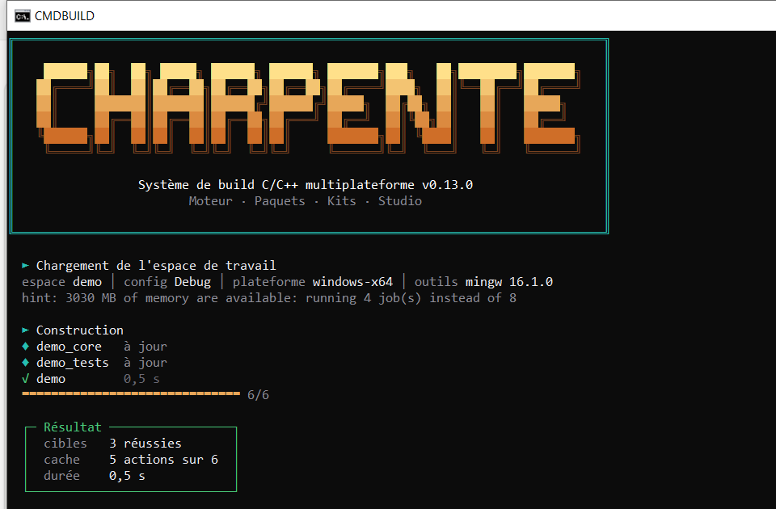
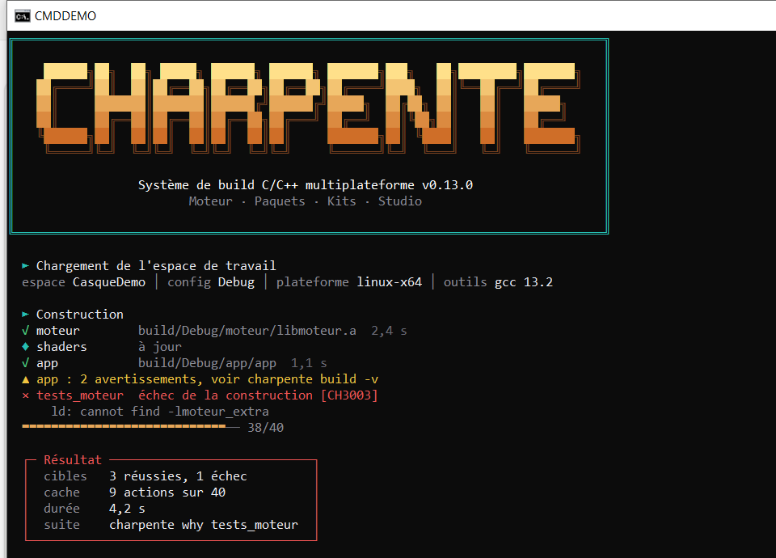
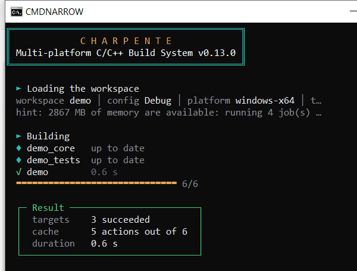
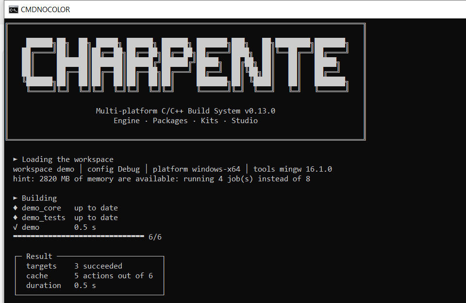
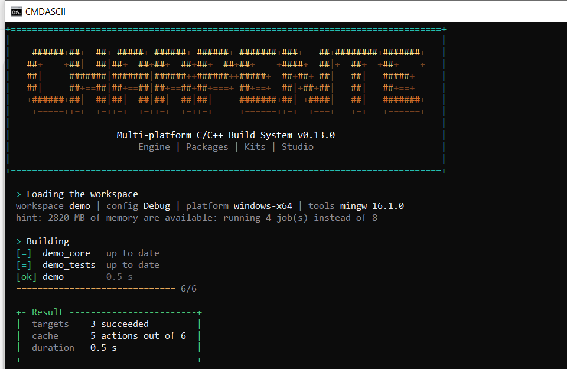
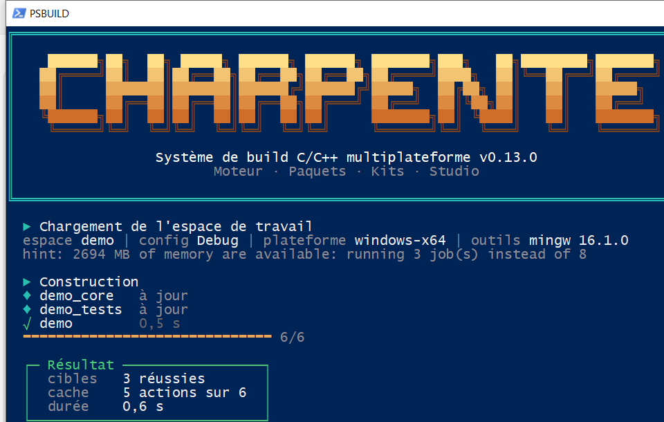

# The console interface: `charpente` alone

Type `charpente` in a terminal with no command and a guided menu opens. It is for people who prefer the terminal to [Charpente Studio](studio.md): you create, build, run, test, package and diagnose
projects by choosing from lists, without having to remember commands.

```
 ■ Charpente 0.13.0   the C/C++ build system
┌─ Where you are ──────────────────────────────────────────────────────────────────┐
│ hello  hello.charpente  ● 3 target(s)                                            │
│ Folder       C:\Users\you\projects\hello                                         │
│ Last build   ● succeeded 2 min ago (build, 1.3 s)                                │
│ Working mode Debug ● this machine (windows-x64)                                  │
│ Compiler     mingw (g++.EXE)                                                     │
└──────────────────────────────────────────────────────────────────────────────────┘
  BUILD AND RUN
   ► 1  Build                            Compile the project (Debug, this machine)
     2  Run                              Build if needed, then start a program
     3  Test                             Build and run the tests
     ...
 ↑↓ move   Enter choose   the key beside a row: shortcut   Esc back   Ctrl+C leave
```

## It teaches the command line

Every choice ends as an ordinary command, **shown before it runs** (`► charpente build --config Debug`). The menu does nothing the command line cannot do: it starts the same code as
`charpente build` and friends, never through a shell, and asks before anything that deletes files. Use it until you know the commands, then stop using it.

## Using it

| Key | Action |
|---|---|
| Up / Down (also Home, End, PgUp, PgDn) | Move the selection (rows that cannot be used are skipped) |
| Enter | Choose the selected row |
| The key beside a row (`1`, `g`, `s`, `m`...) | Choose that row at once |
| Esc, Left arrow, `q` inside a sub-menu | Back |
| `q` at the main menu, or Ctrl+C anywhere in a menu | Leave |
| Ctrl+C at a question | Cancel the question |

Where arrow keys are not available (output piped to a file, `CHARPENTE_CONSOLE=plain`, a terminal that cannot be driven) the same menus work by typing the number or letter and pressing Enter.
`charpente menu` opens it explicitly, in any of those situations.

## What is in it

**When the folder has no project**: *Create a new project* (pick one of the templates, give it a name, confirm; the new project is opened), *Open an existing project* (the projects in the folders below, or type a path),
*Prepare this machine* (`charpente setup`, recommended when no compiler was found), *Check this machine* (`charpente doctor`), *Learn: the first steps*, Studio, language, help.

**When it has one**:

| Group | Rows |
|---|---|
| Build and run | Build, Run (asks which program when there are several, and its arguments), Test, Rebuild on every change (`charpente dev`) |
| Your project | Targets and packages (list targets, search and install packages, kits), Target platform (this machine, Linux ARM, Android, web, microcontrollers...; only what this machine can build is selectable, the others say what is missing; installs on Android devices), Package (zip, installer, apk), Quality check (fast, standard, strict) |
| Tools | Diagnose and understand (explain an error code, why something was rebuilt, history, costly headers), Git (status, checked commit, push, hooks), Cache and cleaning (each deletion asks first), Studio, terminal UI |
| This session | Switch Debug / Release (shortcut `m`), language (English / Français, remembered), help |

The frame at the top shows where you are: the project and its targets, the last build and how it went, the working mode (configuration and platform), and the compiler found. A project file that you have not approved yet is
**not run** to draw this frame (it says "not approved yet"): Charpente asks the first time you build, as usual ([security.md](security.md)).

## On small and old terminals

Below 46 columns, or (with arrow keys) below 42 rows, the frame shrinks to two lines and the tip is left out, so the menu keeps its room; a menu longer than the screen scrolls. If the terminal cannot show box-drawing
characters, ASCII frames are used. `NO_COLOR` turns colours off. On Windows the console is asked to understand ANSI sequences; if it refuses, plain line input is used.

## Settings

| Variable | Effect |
|---|---|
| `CHARPENTE_CONSOLE=off` | A bare `charpente` prints the plain help, as before (scripts and pipes always get the plain help) |
| `CHARPENTE_CONSOLE=plain` | No arrow keys, colours or screen clearing: type the row's number or letter |
| `NO_COLOR` | No colours |
| `CHARPENTE_LANG` | `en` or `fr` (the menu's *language* row also remembers your choice) |

## Verified, and not

* **Verified**: 96 automated tests (drawing at several widths, both languages, every flow with scripted answers, a real project created, built and run through the menu) and a **real Windows pseudo-console (ConPTY)**:
  arrows, shortcuts, redraw, text input after key navigation, Ctrl+C cancelling a question, creating, building and running a project, in English and French. That last check found one real defect
  (Windows reports Ctrl+C at a prompt as end of input, which closed the program), now fixed and tested.
* **Not verified**: the POSIX key reader (Linux, macOS) was written from the terminal specification and its decoding is unit-tested, but it was never run in a real Linux or macOS terminal; other Windows terminals than
  ConPTY-based ones (old `conhost` with legacy rendering); very small terminals by eye (checked by the tests only).


# The look of the console: banner and build lines

Since the console style (`charpente/ui/`), an interactive `charpente build` looks like this: a banner (once), then the stages of the build, one line per target, a progress
bar and a result box. What is drawn adapts to the terminal; nothing changes for programs.



```
  ▸ Loading the workspace
  workspace CasqueDemo │ config Debug │ platform linux-x64 │ tools gcc 13.2

  ▸ Building
  ✔ engine          build/Debug/engine/libengine.a  2.4 s
  ◆ shaders         up to date
  ✔ app             build/Debug/app/app  1.1 s
  ▲ app: 2 warnings, see charpente build -v
  ✘ engine_tests    src/tests.cpp:9: undefined reference to 'f' [CH3003]
  ━━━━━━━━━━━━━━━━━━━━━━━━━━━━── 38/40

  ╭─ Result ──────────────────────────────╮
  │  targets  3 succeeded, 1 failed       │
  │  cache    11 actions out of 40        │
  │  duration 4.2 s                       │
  │  next     charpente why engine_tests  │
  ╰───────────────────────────────────────╯
```

## When you see it

* The **banner** is shown once per process, on a terminal, for `build`, `run`, `test`, `package`, `deploy`, `dev`, `init`, `setup`, `studio` and the menu (`charpente` alone, where it is on
  the first screen only, and only if the window is tall enough). Never for `--version`, `--help`, `explain`, `serve`, `debug-adapter`, `shell --print-env`, anything with `--json`, with
  `--output plain` or `--output jsonl`, when the output is not a terminal, in CI (`CI`, `GITHUB_ACTIONS`, `GITLAB_CI`, `BUILDKITE`, `TF_BUILD`, `JENKINS_URL`, `TEAMCITY_VERSION`) or
  with `CHARPENTE_NO_BANNER=1`.
* The **styled build lines** replace the plain lines for `build`, `dev` and `deploy` with `--output auto` (the default) on a terminal. `run`, `test` and `package` keep their own lines.
  `--output plain`, `--output jsonl` and `--output rich` are unchanged, byte for byte (tests compare them with references recorded before this work). `-v` gives the plain, detailed output.
* `python -m charpente.ui` shows the banner and a made-up build, to judge the look without building anything (`--theme`, `--lang`, `--color`, `--ascii`, `--symbols`, `--width`, `--ok`).

## Themes and settings

| Variable | Effect |
|---|---|
| `CHARPENTE_THEME` | `bois` (default: gold to brown, turquoise frame), `neon` (pink), `foret` (greens, gold frame), `ocean` (blues, orange frame). An unknown name gives the default. |
| `CHARPENTE_NO_BANNER=1` | No banner. |
| `CHARPENTE_COLOR` | `auto` (default), `always` (colours even into a file), `never`. |
| `CHARPENTE_ASCII=1` | Draw with ASCII only (`+ = \|`, `[ok] [=] [!] [x]`); the logo is drawn with `#`. |
| `CHARPENTE_SYMBOLS` | `modern` or `safe`: which symbols to use (see below). Detected when not set. |
| `NO_COLOR` | No colour and no escape sequence at all; it beats every other setting, including `FORCE_COLOR`. |
| `FORCE_COLOR` | `1`, `2`, `3` force 16, 256, 24-bit colour; any other non-empty value forces what the terminal supports; `0` is ignored. |

The language is the usual one (`CHARPENTE_LANG`, the remembered setting, `LANG`).

## How it adapts

| Situation | What you get |
|---|---|
| 80 columns or more, Unicode | The full logo, with the widest inner margin (3, 2 or 1 space) that fits: 84 columns or more for margin 3, 80 for margin 1 |
| Narrower | A compact frame: `C H A R P E N T E` and the subtitle, clipped to the width (one column is always left free: writing in the last column makes some Windows consoles wrap early) |
| Encoding that cannot write the drawing characters, or `CHARPENTE_ASCII=1` | ASCII frame and symbols, accents folded (`Systeme`) |
| `NO_COLOR`, `CHARPENTE_COLOR=never`, `TERM=dumb` | No escape sequence |
| `COLORTERM=truecolor`, Windows Terminal (`WT_SESSION`), VS Code, iTerm, a Windows 10 console with ANSI processing on | 24-bit colour |
| `TERM` containing `256` | The nearest of the 256 colours |
| Anything else | The nearest of the 16 basic colours |
| `FORCE_COLOR`, `CHARPENTE_COLOR=always` | Colour even when the output is not a terminal |
| A classic Windows console (`cmd.exe`, PowerShell in the console host: no `WT_SESSION`, `TERM_PROGRAM` or `TERM`) | The **safe symbols** `► √ ♦ ▲ ×`, a `▬` progress bar and a square-cornered box: the default console font has no `✔ ✘ ◆`, which showed as empty boxes in a real window (see the screenshots) |

On Windows the console is asked to switch ANSI processing on (`ENABLE_VIRTUAL_TERMINAL_PROCESSING`, through `ctypes`, without starting a process); if it refuses there is no colour.

Any display problem (a closed output, an encoding that cannot write a character, a width of 0 or 10,000 columns) gives a plainer picture; it never fails a build.

## Screenshots (real windows, Windows 10)

| Case | Capture |
|---|---|
| `cmd.exe`, 100 columns: the demonstration |  |
| `cmd.exe`, 60 columns: the compact banner |  |
| `cmd.exe`, `NO_COLOR=1` |  |
| `cmd.exe`, `CHARPENTE_ASCII=1` |  |
| Windows PowerShell 5.1 (console host), a real build |  |

Redirected to a file (`charpente build > out.txt`) the output is the plain text as before: no banner, no escape sequence.

**Not verified**: Windows Terminal and PowerShell 7 (neither is installed on the development machine), Linux and macOS terminals, other fonts than the console default. The 24-bit, 256-colour and
16-colour paths, and the symbol choice, are covered by unit tests only outside Windows.
